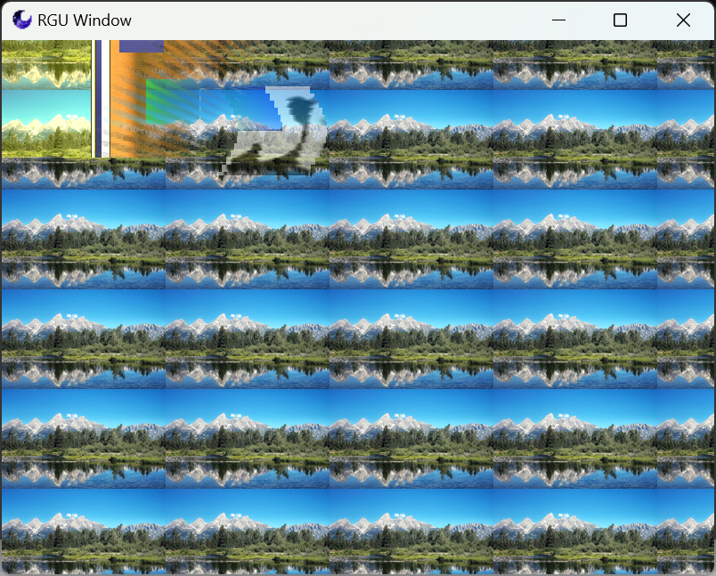
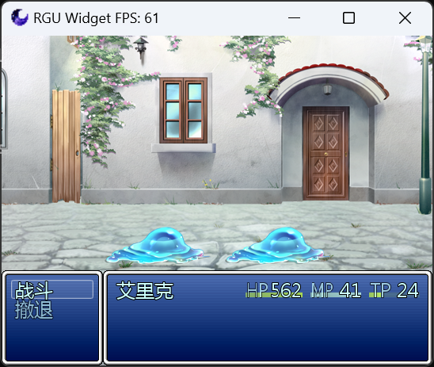

#  RGU Player Core

## 项目概述

RGU是一款兼容RGSS 1/2/3，使用SDL作为底层，
OpenGL ES(2.0) 图像标准编写渲染部分的异步多线程2D游戏引擎。
旨在提供兼容RGSS的同时提供跨平台与性能提升支持。

本项目使用BSD-3协议开源。

本项目语法风格与代码结构与The Chromium Project相似。

## 项目结构

运行结构为多线程异步架构，程序内存在多个线程worker，每个worker都有任务投递的接口，
引擎将事件处理，逻辑处理，图像渲染处理，音频播放处理，视频解码处理等分解为多个线程，
其中可选将图像渲染线程与逻辑线程合并（测试使用），逻辑线程负责向其他worker线程投递任务。

源码结构分为逻辑实现，图像渲染实现，基础库实现，封装组件实现与脚本引擎绑定实现，
整个程序的入口在app文件夹中，
content文件夹中存放负责组织引擎全部内容（图像，输入，音频）功能的代码，是引擎的核心实现，
components中存放引擎中的某些特定组件实现（如IO系统，fps计数器等），
base文件夹中存放跨平台的基础代码，
binding文件夹中存放与cruby，mruby等第三方解释器进行绑定的代码
buildtools中存放所有的python自动化代码
renderer文件夹存放了GLES2.0的封装版本代码
third_party中为使用的第三方代码库，base/third_party中也有部分第三方库
ui文件夹存放了SDL窗口的封装代码，用于与input模块进行配合操作

## 开发中截图

## 编译项目

 - 本项目使用CMake管理编译。
 - 第三方依赖库部分使用Git拉取，部分需要用户自行编译处理。
 - 项目中需要使用Python3来生成自动编译文件，请确保系统中已安装Python3。

※ 开发中暂不提供编译步骤。

## 系统要求

- Windows 7及以上
- Linux 发行版 (具体依赖发行版的内核版本)
- Android 5.0及以上
- 其他平台支持计划中

## 思路来源

- Chromium
- RGM
- MKXP
- SDL
- SFML

## 第三方库使用

- Chromium - https://www.chromium.org/chromium-projects/
- SDL - https://github.com/libsdl-org/SDL
- SDL_image - https://github.com/libsdl-org/SDL_image
- SDL_ttf - https://github.com/libsdl-org/SDL_ttf
- ANGLE - https://chromium.googlesource.com/angle/angle
- CRuby - https://www.ruby-lang.org/zh_cn/
- MRuby - https://mruby.org/
- Physfs - https://github.com/icculus/physfs
- concurrentqueue - https://github.com/cameron314/concurrentqueue
- aom - https://aomedia.googlesource.com/aom
- json - https://github.com/nlohmann/json
- zlib - https://github.com/madler/zlib
- json - https://github.com/nlohmann/json

## 联系方式

- AFDian: https://afdian.net/a/rguplayer
- Mail: 2755482106@qq.com

© 2024 Admenri