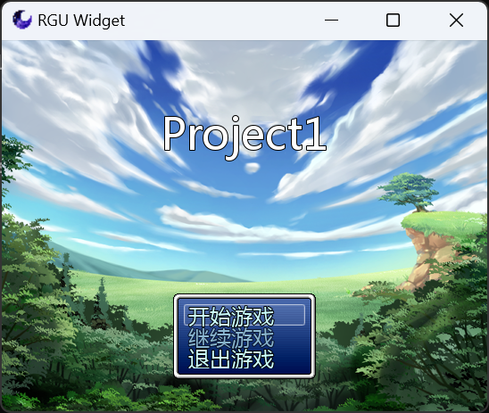

#  RGU Player Core

## 概述

 - RGU是一款兼容RGSS 1/2/3，使用 SDL3 作为底层，OpenGL ES(2.0) 图像标准编写渲染部分的异步多线程2D游戏引擎。  
 - RGU在提供兼容原版RGSS的同时提供跨平台与性能提升支持，同时提供诸如自定义着色器与网络扩展在内的加强功能。  
 - 本项目使用BSD-3协议开源。  
 - 本项目语法风格与代码结构与The Chromium Project相似。
 - 程序灵感来源于 Chromium RGM RGD MKXP

## 程序结构

- 程序运行结构为多线程架构，程序内存在多个线程worker，每个worker都有任务投递的接口，引擎将事件处理，逻辑渲染处理，音频播放处理，视频解码处理，网络处理等分解为多个线程。   
- 游戏的图像渲染采用 OpenGL ES(2.0) 标准以获得最大兼容。  
- 用户可以选择使用ANGLE运行其他渲染器后端（D3D9 D3D11 Vulkan Metal 软渲染等）以应对显卡驱动兼容问题。  
- 引擎的事件输入处理基于 SDL 的事件处理。  
- 引擎的音频处理基于 SoLoud 库，音频数据通过Soloud核心处理后输出到SDL的音频设备接口。  
- 引擎的脚本处理部分使用了 Ruby3 的解释器。  

## 软件截图

## 构建项目
### 0. 注意事项

 - 本项目使用CMake管理编译。
 - 第三方依赖库部分使用Git拉取，部分需要用户自行编译处理。
 - 项目中需要使用Python3来生成自动编译文件，请确保系统中已安装Python3。

### 1. 拉取源码
#### 拉取项目源码
 - git clone https://github.com/Admenri/rguplayer.git rguproject
#### 拉取第三方库源码
 - cd rguproject
 - git submodule update --init --recursive

### 2. 针对不同环境开始构建
#### Windows (测试环境：Windows 11 23H2 & Visual Studio 2019 & Clang-LLVM)
 - 可以直接使用 Visual Studio 内置的 CMake 功能进行快捷构建，编译器建议选择Clang-LLVM

#### Linux (测试环境：Ubuntu 23.10 & Visual Studio Code & GCC 13)
 - 确保系统安装了OpenGL开发库和CRuby开发库
 - 在目录执行：cmake -S . -B out 以生成工程
 - 之后执行cmake --build out执行构建

#### Android (测试环境：Android 13.0 & Android Studio & Windows 11 23H2)
 - 确保系统安装了Android Studio，Android NDK，CMake
 - 确保可以在开发环境下编译出成品程序（例如Windows下先编译出exe）
 - 然后使用Android Studio打开 “android-project” 文件夹
 - 之后即可直接执行 Build Project 开始构建

## 系统支持

- Microsoft Windows 7 及以上
- GNU/Linux 6.5.0 及以上
- Android 8.0 及以上
- 目前不支持Apple系的任何操作系统（macOS，iOS），欢迎有mac设备的同志贡献代码

## 第三方库使用

- SDL - https://github.com/libsdl-org/SDL
- SDL_image - https://github.com/libsdl-org/SDL_image
- SDL_ttf - https://github.com/libsdl-org/SDL_ttf
- ANGLE - https://chromium.googlesource.com/angle/angle
- concurrentqueue - https://github.com/cameron314/concurrentqueue
- CRuby - https://www.ruby-lang.org/zh_cn/
- Physfs - https://github.com/icculus/physfs
- zlib - https://github.com/madler/zlib
- inih - https://github.com/jtilly/inih
- soloud - https://github.com/jarikomppa/soloud
- imgui - https://github.com/ocornut/imgui
- aom - https://aomedia.googlesource.com/aom/
- vorbis - https://github.com/xiph/vorbis
- ogg - https://github.com/xiph/ogg
- boost_asio - https://github.com/boostorg/boost

## 联系方式

- AFDian: https://afdian.net/a/rguplayer
- Mail: 2755482106@qq.com

© 2015-2024 Admenri
